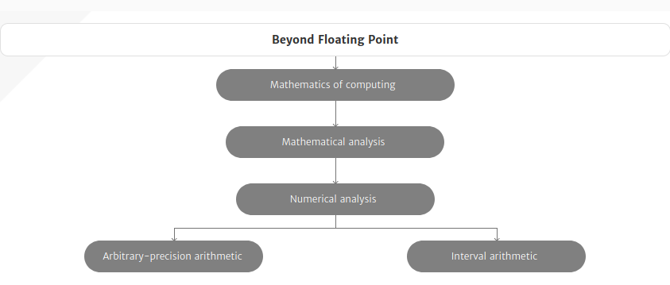
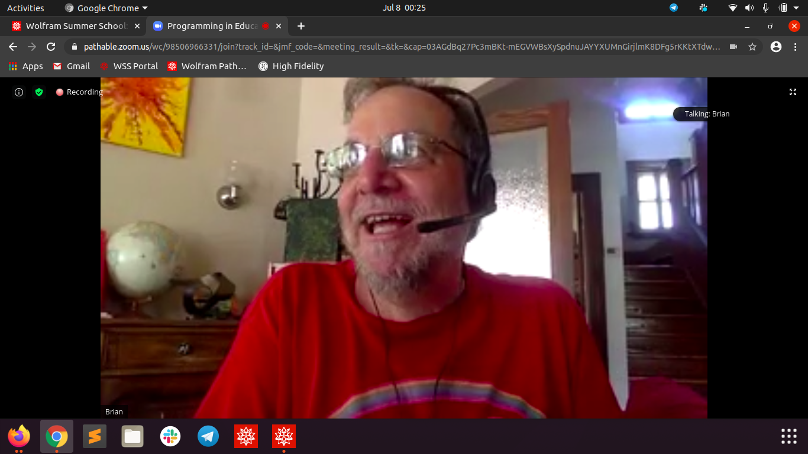

----------
###### Title: WSS'2020 - Day 10
###### Date: 07-07-2020
----------
&nbsp;

> ***Research Note***: In the field of scientific computation generally and especially in experimental computing which is often at the heart of simulation and modeling problems, 
> the availability of a robust system of arithmetic offers many advantages. Many such computational problems are prone to failure due to overflow or underflow or
> to a lack of advance knowledge of a suitable scaling for the problem. The use of a computer arithmetic system which is free of these drawbacks would clearly 
> alleviate any such difficulties.
>
> One such arithmetic is the symmetric level index, SLI, system. (See [3] for an introductory summary.) This system was developed from the original level-index system
> of Clenshaw and Olver [1] and has been studied in a number of subsequent papers. Working to any finite precision, it is closed under the four basic arithmetic
> operations (apart from division by zero, of course) and is therefore free of underflow and overflow. The arithmetic system allows very large or very small numbers 
> which may not be representable in a conventional floatingpoint system to be used during interim computation while still returning meaningful results.

>***Research literature-study starts:***\
> [Some introduction to Floating-point arithmetic(not very helpful for my project)](https://docs.oracle.com/cd/E19957-01/806-3568/ncg_goldberg.html#687)\
> [Some introduction to Posit arithmetic](https://web.stanford.edu/class/ee380/Abstracts/170201-slides.pdf)\
> Most of the research papers of *C. W. ClenshawF. W. J. Olve*, and, *D. W. Lozier & P. R. Turner* are not freely available.\
> Couldn't understand anything out of the Perl code of Hypercalc. Reading and trying to implement from that would hence be last resort.\

&nbsp;
> ***Note:*** Later read: [Large Numbers](http://www.mrob.com/pub/math/largenum.html)\
> Also,Some areas to ponder upon after basic implementations are complete [here](https://mrob.com/pub/math/hyper4.html#power_tower_paradox)\
&nbsp;
> Read [this](https://www.ncbi.nlm.nih.gov/pmc/articles/PMC4927227/) for applications of Level-Index Arithmetic in mathematical problems/modern industry./

&nbsp;
>Attended [Brian Silverman](https://en.wikipedia.org/wiki/Brian_Silverman)'s lecture, the man who was in the development team of LOGO (Turtle?). Overwhelming to directly listen to and have an opportunity to interact with a person who had made LOGO which we were taught in school when we were very young!\
&nbsp;

&nbsp;
> Met Luke Neville(from England) and Douw Marx(from South Africa) in Random Coffe Break (Wolfram arranged random coffee breakouts in group of 3 so that people 
> could interact and get to know each other. Saulo da Paz Almeida (from Brazil) also joined us. Had a nice chat with everybody regarding education system in
> different countries, span of Bachelors and PhDs in Brazil very long :P, Covid situation, etc\

> Mentor gather and sent a paper of ACM Digital Library : Level-Index Arithmetic Operations by C. W. Clenshaw and F. W. J. Oliver. Couldn't understand much from 
> the notations :/

&nbsp;
> ###### [Next Day](Day11.md)
