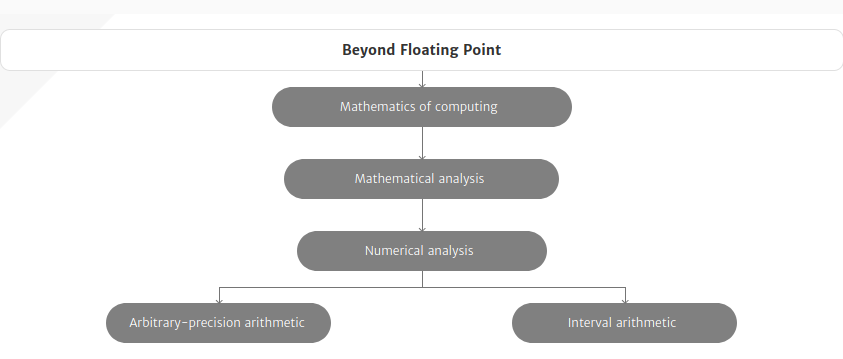

----------
###### Title: WSS'2020 - Day 10
###### Date: 07-07-2020
----------
&nbsp;

> ***Research Note***: In the field of scientific computation generally and especially in experimental computing which is often at the heart of simulation and modeling problems, 
> the availability of a robust system of arithmetic offers many advantages. Many such computational problems are prone to failure due to overflow or underflow or
> to a lack of advance knowledge of a suitable scaling for the problem. The use of a computer arithmetic system which is free of these drawbacks would clearly 
> alleviate any such difficulties.
>
> One such arithmetic is the symmetric level index, SLI, system. (See [3] for an introductory summary.) This system was developed from the original level-index system
> of Clenshaw and Olver [1] and has been studied in a number of subsequent papers. Working to any finite precision, it is closed under the four basic arithmetic
> operations (apart from division by zero, of course) and is therefore free of underflow and overflow. The arithmetic system allows very large or very small numbers 
> which may not be representable in a conventional floatingpoint system to be used during interim computation while still returning meaningful results.
>

&nbsp;
> ###### [Next Day](Day11.md)
