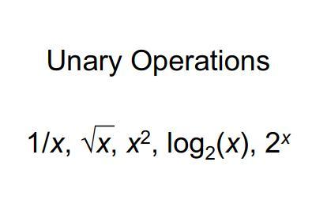
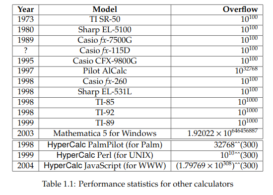

----------
###### Title: WSS'2020 - Day 11
###### Date: 08-07-2020
----------
&nbsp;

> Got a mail from [Robert Munafo](https://mrob.com/) about JS Source code of HyperCalc. Inspecting that is much helpful than reading papers for the basic arithmetic
> operations' implementation.

> Implemented addition operations. Got a lot of help from Daniel Sanchez, TA, WSS'2020. He's a life-saver, helped a lot. TYSM!!<3\
> Got tips and suggestions from mentor.
> Addition and subtraction is now working perfectly.(5.23am)

> Task still left:
- [ ] Multiplication
- [ ] Exponentiation
- [ ] Division
- [ ] A + PowerTower
- [ ] A * PowerTower
- [ ] Implement pow10/log10 and gamma.
- [ ] Different bases doesnt work yet
- [ ] Invoke my entire package when normally Mathematica overflows
- [ ] remove string format from radix such that evaluations happens automatically
- [ ] How to support (27^86)!   ??? (***Confused Area***)
- [ ] work on better precision of index (N[index, large digit precision]????) (***Confused Area***)
- [ ] How does it behave for Non-Integral Power Towers (complex numbers, fractions, etc.) (***Research Focus***)

> Try to implement these functions also:

&nbsp;
> ###### Things I can add in description of project: 
> - The representation is not unique
> - Floating point arithmetic useless for most linear algebra systems (Invisible rounding errors)
> - Further look into this link: https://link.springer.com/article/10.1007%2FBF02238636

&nbsp;
> ***Doubt***: It does this by using a modified form of the level-index number system with a radix of 1.0e300(HyperCalc)?

&nbsp;
> ###### [Next Day](Day12.md)

