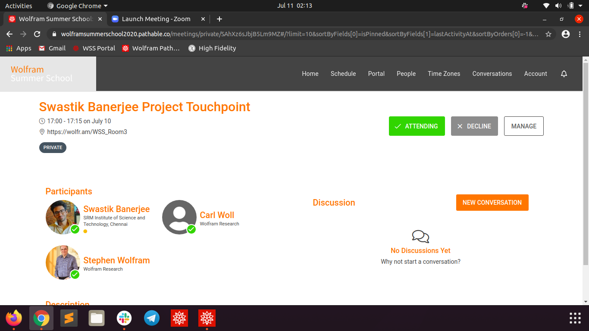

----------
###### Title: WSS'2020 - Day 13
###### Date: 10-07-2020
----------
&nbsp;

> Changed the radix back to what it was, and fixed the base to 10, i.e, no option for user to change the base.
> Found the following issues in my current notation:
- Doesn't work for PowerTowers like 10^10^10^10^10^10
- Cannot deal with PowerTowers like 10^2^1^9^8^7^2^6^4, where answer should actually be 10^2.

My next steps would be:
- [ ] Complete the functions listed as ToDos in the current notation as much possible, and see how non-integral power-tower works, and save it as current progress up till now.
- [ ] Read up the papers sent by mentor, and try to implement the classical level-index notation to do-away with all the issues.
- [ ] Implement HyperCalc's algo if nothing works.
- [ ] Examine non-integral power towers again after all these.

> ###### Update:
> - I implemented most of the basic functions like Addition, Subtraction, Multiplication and Division for the current Notation
> - [ ] Need to implement Exponentiation and Logarithm still
> - Made a presentable notebook to show Stephen Wolfram in Project Touchpoint.\
&nbsp;

&nbsp;
> Stephen said "it's really nice to see this project work." He said he always wanted to have this thing in Mathematica/ make this work, and it's nice to see it
> finally working!\
> ***Trust me, things can be really hard in Research work. Last two days have been most hard, with little sleep, thinking straight for hours and hours, keeping 
myself dozed on Monster and still feeling everything of the project is falling apart everytime I find a new corner-case not working***.\
> But Stephen encouraged, saying this is expected! And, also mentioned a few series, factorials, and areas related to hypergraph I might wanna have a look at,
> as it involves really interesting mathematics.\
> Finally see some light at the end of the tunnel.\
> These are the moments to live for.\
> I've always wanted to work in the branch connecting Mathematics and CS, and it's safe to say this is the first time I'm living my dream! But definitely not
> the last.\
> Placements starting soon, but I'd never give up the passion of research for a 9-5 job (as of July 10,2020 :P Might change later).\
> **Q.E.D.**

&nbsp;
> ###### [Next Day](Day14.md)
