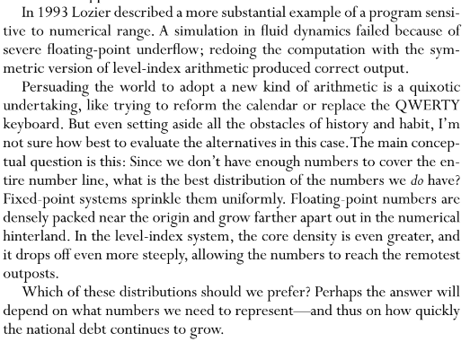

----------
###### Title: WSS'2020 - Day 14
###### Date: 11-07-2020
----------
&nbsp;

> - Still Have some issues in division
> - [ ] PowerTower[{10, 10, 10, 2}]/PowerTower[{10, 10, 10, 10, 2}] doesn't work (gives 10^overflow. This overflow actually happens in addition,a special case)
> - [ ] PowerTower[{10, 10, 10, 2}]/PowerTower[{10, 10, 2}] gives erroneous result 
> - [ ] PowerTower[{10, 10, 10, 10, 2}]/PowerTower[{10, 10, 2}] gives erroneous result

&nbsp;
&nbsp;
**Due to the issues faced in the initial implementation, there is a real need to do a careful implementation of the core algorithms.**
&nbsp;
&nbsp;
> ###### Read the following Research Papers: 
> - [Level-Index Arithmetic Operations](2157569.pdf) by Clenshaw and Olver
> - [Symmetric level-index algorithm](8-4-517.pdf) by Clenshaw and Turner

> - A nice writing\
\

&nbsp;
> ###### [Next Day](Day15.md)

