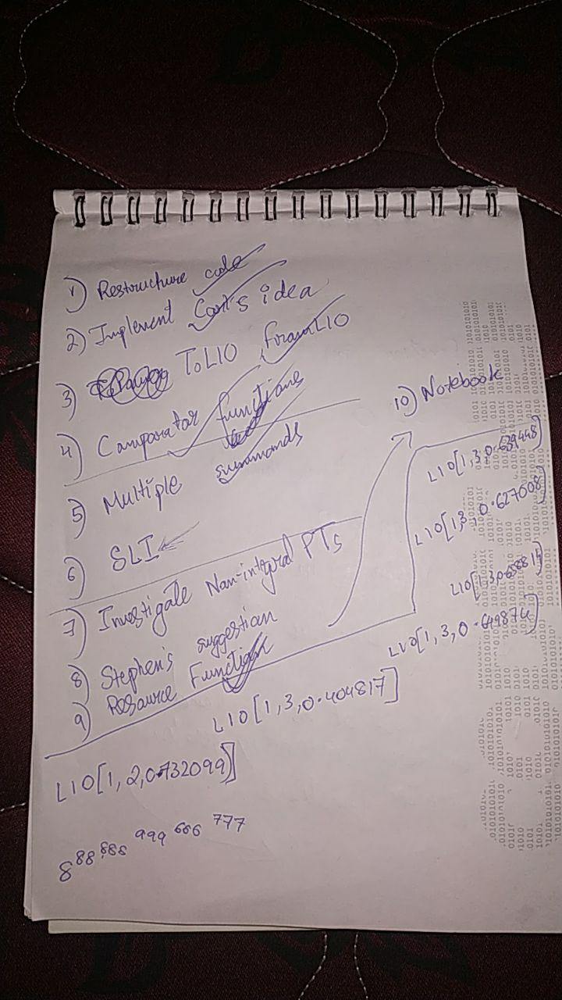

----------
###### Title: WSS'2020 - Day 16 & 17
###### Date: 13-07-2020 & 14-07-2020
----------
&nbsp;

> Had intense workload. Didn't have time to upload the blog.
> ***Basically***:
> - Edited, rewrite, debugged, redited my code thousand times.
> - Dealt with loads of edge cases and bugs in code.
> - Worked with mentor, Carl Woll, for more than 1 hour at midnight to fix bugs and issues and strategies and algorithms.
> - Intense thinking straight for hours and hours.
> - Panic
> - Too depressing, felt like almost giving up. Again picked myself up, worked on it. Fixed issues. Got help from mentor. Reshaped the project.
> - Things seemed stable the second day,i.e, on 14th. Still lots of issues to be dealt with. Here is a picture of my homeworks and notes, and ToDO lists of the last
day or so: 

&nbsp;

&nbsp;
> - Things are taking shapes and looking better.
> - Work almost complete. Pulled two all-nighters consecutively. Most of the functions seem to work now.

###### Also read [Beyond Floating Point Arithmetic](62.322429.pdf) (the paper where Clenshaw and Oliver first introduced the level-index notation) to understand the intentions of my projects better and to the depth.
###### Talked to Sathvik Ajay about which lectures that I missed should I definitely consider watching later!

&nbsp;
> ###### [Next Day](Day18.md)

