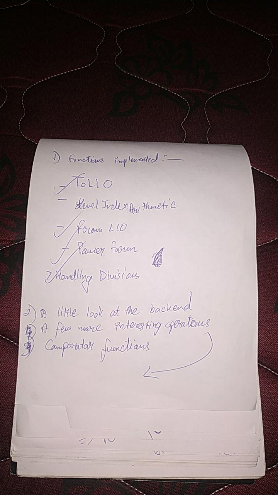

----------
###### Title: WSS'2020 - Day 19
###### Date: 16-07-2020
----------
&nbsp;

> - Poster Session 
> - Pulled an All-nighter and met a lot of cool people from Wolfram Research, Special Guests and HR
> - Explained projects to Summer Camp students
> - Gave an interview to Mandi and Hannah
> - Met Wenzhen Zhu from Amazon who works in ML Solutions Lab in the US. Talked about ICPC, where she was a participant in 2014.
> - Graduation Ceremony, where Stephen acknowledged everyone's project.

> ###### After Poster-Session adda with Stephen:

> ###### 

&nbsp;
> ###### [Next Day](Day18.md)

